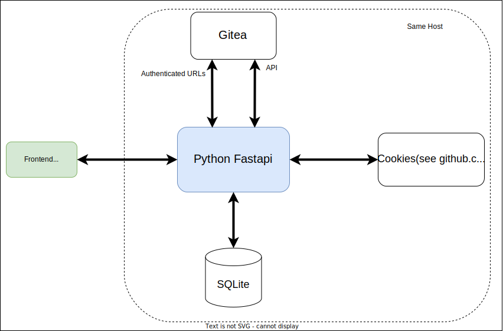

> 🛠️️ This project is pre-alpha and under heavy development! It's planned to have it 'finished' by ~September 2023

# What is schoco? {🍫}

SCHOCO stands for <ins>**SCH**</ins>ool <ins>**O**</ins>nline <ins>**CO**</ins>ding.

The project is heavily inspired by [codeboard.io](https://codeboard.io) ([github](https://github.com/codeboardio)). Since codeboard didn't receive any more updates since end of 2015 and as we need slightly other features, we now try to create a similar web-based IDE which fits to our needs for **learning (Java)-Programming explicitly at School**! 

---
It is mainly developed to enable coding-homeworks for pupils what has failed so far in reality for two reasons:
 1. Installation of the cumbersome JRE and IDEs
 2. Saving and sharing the solutions via Mail/USB/Messenger??? WTF!?
---

## Planned main-features
- No registration methods for pupils. Only teachers can register pupils who will always be part of a class or course.
- Pupils see coding-homeworks when logging in and they can code, compile, run and commit their homework completely online without the need of an offline installation of the JRE or any other software.
- JUnit for automatic testing of the commited homework
- Teachers can open pupils solutions with a single click and show/compare them at the beamer in the classroom without sending directories or files.
- Explicitly no possibility to open foreign projects based on a project-id or similar (other than codeboard!). That's first because of privacy-reasons and second to minimize copying from others.
- Use gitea on backend for storing all code.
- Compilation and running the programs completely on the server (see /cookies - WIP).

## Architecture

## Progress
Even a completed task just means, that the specific base-work is done, but that the feature might still need some fine tuning...
- [x] Usermanagement (Registration an login for teachers and pupils) and extended rights for teachers 
- [x] Classroom-management (Creation of courses and assigning pupils to courses)
- [x] Create a new Java-Project based on a Hello-World-template
- [x] Open my own Projects in the IDE
- [x] Interaction with Gitea on localhost or different Host (HTTPS): (Loading all files and save changes)
- [x] Worker-Queue (or comparable) for cookies
- [x] Make cookies work (see [/cookies](/cookies))
    - [x] Compilation
    - [x] Running/Executing (Input and output can be send via Websocket ✔)
    - [x] JUnit-Testing
- [ ] Make homework out of projects with deadlines, submitting, view pupils solutions as teacher, ...
- [ ] Save amount of compilations, executions,... per project and make them visible
- [ ] Mark projects as templates (when being a teacher)
- [ ] Import/export projects/templates as zip

# Start developing

On the linux-host both following packages need to be installed: `libcurl4-openssl-dev libssl-dev`

## 1) Gitea
You have to use Gitea as git-repo, since schoco uses the gitea-API.

### Option A: *Localhost*
Install gitea using the docker-compose.yml file from this repo. You can choose to set gitea public available via browser, but actually that's not necessary and you can skip reverse-proxying gitea -> it's enough to have it only available at localhost.

If you used the docker-compose.yml from this repo, then you'll need to do a second step **only once for installation**. Run the following command to create the git-user (use a better password!):
`docker exec --user 1000 gitea gitea admin user create --admin --username schoco --password schoco1234 --email schoco@example.com`

### Option B: *External instance (public available)*

Host your gitea-instance anywhere (secured by TLS!!) and connect to it. This will lead to a speed drop caused by increased latency, since every file sadly needs a separate API-call.

## 2) Frontend (Vite 4 + Vue 3)
`cd frontend` 

Initial Installation: `npm install`

On every start: `npm run dev`

## 3) Backend (Fastapi)

`cd fastapi`

Initial Installation (Python 3.10 and pip required): `pip install -r requirements.txt`

On every start: `export FULL_DATA_PATH=/full/path/to/data_folder MAX_CONTAINERS=2 SECRET_KEY=secret TEACHER_KEY=teacherkey GITEA_LOCALHOST_PORT=3000 GITEA_USERNAME=schoco GITEA_PASSWORD=schoco1234 && python -m uvicorn main:schoco --log-level debug --reload`

If your gitea-instance is NOT running on localhost, then exchange `GITEA_LOCALHOST_PORT` with `GITEA_HOST=https://git.mydomain.tld`

## 4) Backend ('Cookies' for compilation/execution)
**This chapter is currently WIP and may receive large changes!**

Probably only necessary in production:  
- Prepare System by creating a new user:group 'schoco:schoco' with ids '1234:1234', which is used to run the containers! `sudo groupadd --gid 1234 schoco` and  `sudo useradd --uid 1234 --gid 1234 -m -d /home/schoco schoco`

*Following part should <ins>**NOT**</ins> be necessary, when using nginx to reverse-proxy incoming WS to docker.sock!*
- Make Docker-API public available to enable to attach WSS to running container.  
See: https://docs.docker.com/config/daemon/remote-access/  
**IMPORTANT: Only allow URL /containers/{id}/attach to pass through the webserver!**