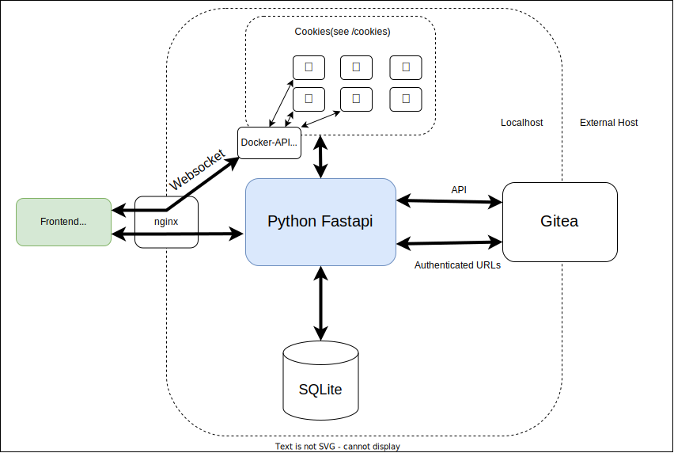

> 🛠️️ This project is close to alpha-testing (May 2023) and under heavy development! It's planned to have it 'finished' by ~September 2023

# Chapters
- [What is schoco? {🍫}](#what-is-schoco-)
  - [Main-features](#main-features)
  - [Architecture](#architecture)
  - [Progress](#progress)
- [Start developing](#start-developing)
- [Build and run schoco locally](#build-and-run-schoco-locally)

# What is schoco? {🍫}

SCHOCO stands for <ins>**SCH**</ins>ool <ins>**O**</ins>nline <ins>**CO**</ins>ding.

The project is heavily inspired by [codeboard.io](https://codeboard.io) ([github](https://github.com/codeboardio)). Since codeboard didn't receive any more updates since end of 2015 and as we need slightly other features, we now try to create a similar web-based IDE which fits to our needs for **learning (Java)-Programming explicitly at School**! 

---
It is mainly developed to enable coding-homeworks for pupils what has failed so far in reality for two reasons:
 1. Installation of the cumbersome JRE and IDEs
 2. Saving and sharing the solutions via Mail/USB-Stick/Messenger??? WTF!?
---
 
  See all screenshots [here](./readme/README.md)!

---

## Main-features
- No registration methods for pupils. Only teachers can register pupils who can be member of multiple courses.
- Pupils directly see coding-homeworks when logging in and they can code, compile, run and test their homework completely online without the need of an offline installation of the JRE or any other software.
- JUnit for automatic testing of the homework - the newest test-result of pupils is directly visible to the teacher.
- Teachers can open pupils solutions with a single click and show/compare them at the beamer in the classroom without the necessity sending directories or files.
- Pupils can only open their own project or homeworks - no possibility to open the homework-solution of your best buddy. That's first because of privacy-reasons and second to minimize copying from others.
- Use gitea on backend for storing all code.
- Compilation and running of the programs works completely on the server. Done by [/cookies](/cookies) which stands for <ins>**Co**</ins>mpile <ins>**o**</ins>nline, <ins>**k**</ins>eep <ins>**i**</ins>ts <ins>**e**</ins>xecution <ins>**s**</ins>upervised. Well, actually it's part of schoco and therefore the image + container are called schoco-cookies 🍪🤭.

## Architecture

## Progress
**Progress is far (around 90% ?)! <ins>All</ins> important and difficult key-features are working! The Online-IDE is working and projects can be transformed into homeworks which are then editable by the pupils. Teachers can see and view all pupils solutions and their results of JUnit-Tests ✨**

**From now on, there are just a few more features missing (and polishing here and there of course...)**

- [x] Usermanagement (Registration an login for teachers and pupils) and extended rights for teachers 
- [x] Classroom-management (Creation of courses and assigning pupils to courses)
- [x] Create a new Java-Project based on a Hello-World-template
- [x] Open my own Projects in the IDE
- [x] Interaction with Gitea on localhost or different Host (HTTPS): (Loading all files and save changes)
- [x] Worker-Queue (or comparable) for cookies
- [x] Make cookies work (see [/cookies](/cookies))
    - [x] Compilation
    - [x] Running/Executing (Input and output can be send via Websocket ✔)
    - [x] JUnit-Testing
- [x] Make homework out of projects with deadlines, submitting, view pupils solutions as teacher, ...
- [x] Save amount of compilations, executions,... per project and make them visible
- [ ] Mark projects as templates (when being a teacher)
- [ ] Import/export projects/templates as zip

# Start developing

On the linux-host both following packages need to be installed: `libcurl4-openssl-dev libssl-dev`

## 1) Gitea
You have to use Gitea as git-repo, since schoco uses the gitea-API.

### Option A: *Localhost*
Install gitea using the docker-compose.yml file from this repo. You can choose to set gitea public available via browser, but actually that's not necessary and you can skip reverse-proxying gitea -> it's enough to have it only available at localhost.

If you used the docker-compose.yml from this repo, then you'll need to do a second step **only once for installation**. Run the following command to create the git-user (use a better password!):
`docker exec --user 1000 gitea gitea admin user create --admin --username schoco --password schoco1234 --email schoco@example.com`

### Option B: *External instance (public available)*

Host your gitea-instance anywhere (secured by TLS!!) and connect to it. This will lead to a speed drop caused by increased latency, since every file sadly needs a separate API-call.

## 2) Frontend (Vite 4 + Vue 3)
`cd frontend` 

Initial Installation: `npm install`

On every start: `npm run dev`

## 3) Backend (Fastapi)

`cd fastapi`

Initial Installation (Python 3.10 and pip required): `pip install -r requirements.txt`

On every start: `export FULL_DATA_PATH=/full/path/to/data_folder MAX_CONTAINERS=2 SECRET_KEY=secret TEACHER_KEY=teacherkey GITEA_LOCALHOST_PORT=3000 GITEA_USERNAME=schoco GITEA_PASSWORD=schoco1234 PRODUCTION=False && python -m uvicorn main:app --log-level debug --reload`

If your gitea-instance is NOT running on localhost, then exchange `GITEA_LOCALHOST_PORT` with `GITEA_HOST=https://git.mydomain.tld`

## 4) Backend (nginx)
For Websocket-communication, there must always be running nginx (even during development).  
> `docker run -d -p 80:8080 -v /var/run/docker.sock:/var/run/docker.sock -v /path/to/repo/nginx/nginx.dev.conf:/etc/nginx/conf.d/default.conf --name nginx --group-add $(getent group docker | cut -d: -f3) nginxinc/nginx-unprivileged:1.23-alpine`

## 5) Backend ('Cookies' for compilation/execution)

Considering nproc, the separate schoco-user might get interesting!?

Otherwise not necessary (neither during developing nor production): 
- Prepare System by creating a new user:group 'schoco:schoco' with ids '1234:1234', which is used to run the containers! `sudo groupadd --gid 1234 schoco` and  `sudo useradd --uid 1234 --gid 1234 -m -d /home/schoco schoco`

# Build and run schoco locally

1. Build fastapi image: `cd fastapi && docker build -t phitux/schoco-backend:latest .`
2. Compile the cookies API: `cd cookies/api && javac Java_api.java`
3. Build cookies worker image: `cd cookies && docker build -t phitux/schoco-cookies .`
4. Build frontend image: `docker build -t phitux/schoco-nginx:latest .`
5. Create docker network for schoco: `docker network create schoco` 
6. Set the `DOCKER_GROUP_ID` env variable: `export DOCKER_GROUP_ID=$(getent group docker | cut -d: -f3)`
7. Make sure you have a `data/` directory in the repo root. This is where the sqlite db and all temporary code is stored. This may not be owned by root!
8. Start schoco with `docker compose up -d`
9. Schoco is available under [http://localhost](http://localhost)

> **On the first startup** you will need to add the gitea user using the following command
> `docker exec --user 1000 schoco-gitea gitea admin user create --admin --username schoco --password schoco1234 --email schoco@example.com`

