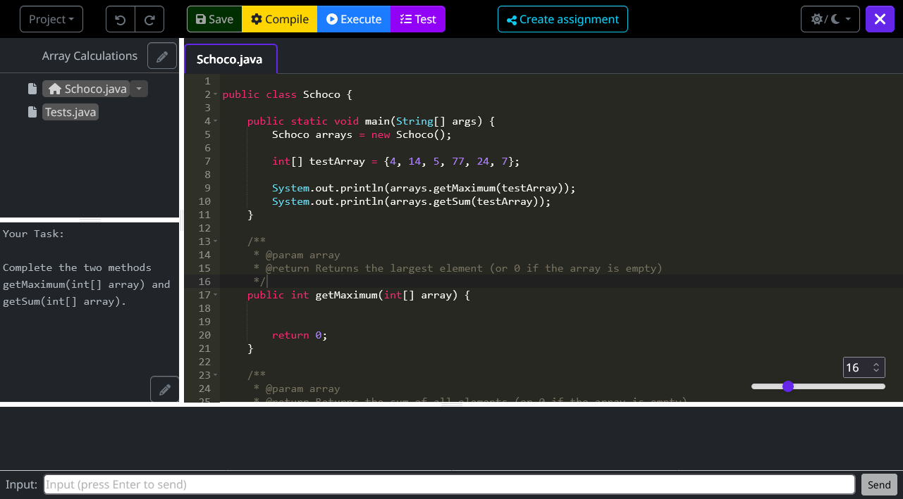

> 🛠️️ This project is close to alpha-testing (May 2023) and under heavy development! It's planned to have it 'finished' by ~September 2023

# Chapters
- [What is schoco? {🍫}](#what-is-schoco-)
  - [Main-features](#main-features)
- [Installation](#installation)
- [Architecture](#architecture)
  - [How it works under the hood](#how-it-works-under-the-hood)
  - [Progress](#progress)
  - [FAQ](#faq)
- [Start developing](#start-developing)
- [Build and run schoco locally](#build-and-run-schoco-locally)

# What is schoco? {🍫}

SCHOCO stands for <ins>**SCH**</ins>ool <ins>**O**</ins>nline <ins>**CO**</ins>ding.

The project is heavily inspired by [codeboard.io](https://codeboard.io) ([github](https://github.com/codeboardio)). Since codeboard didn't receive any more updates since end of 2015 and as we need slightly other features, we now try to create a similar web-based IDE which fits to our needs for **learning (Java)-Programming explicitly at School**! 

---
It is mainly developed to enable coding-homeworks for pupils what has failed so far in reality for two reasons:
 1. Installation of the cumbersome JRE and IDEs
 2. Saving and sharing the solutions via Mail/USB-Stick/Messenger??? WTF!?
---
 
  See all screenshots [here](./readme/README.md)!

---

## Main-features
- Web-based IDE for Java-Programming (Java 8), which is fully functional to Java <ins>except</ins> UIs (obviously), writing files to disk, accessing the internet and a few others. The restrictions are needed for security reasons and are provided by Java's security manager.
- Each user can create private projects and teachers can convert them to homeworks, which are then editable by the pupils of the selected course.
- Pupils directly see coding-homeworks when logging in and they can code, compile, run and test their homework completely online without the need of an offline installation of the JRE or any other software.
- JUnit for automatic testing of the homework - the newest test-result (percent of how many JUnit-Tests passed successfully) of pupils is directly visible to the teacher.
- Teachers can open pupils solutions with a single click and show/compare them at the beamer in the classroom without the necessity of sending directories or files.
- Pupils can only open their own project or homework - no possibility to open the homework-solution of your best buddy. That's first because of privacy-reasons and second to minimize copying from others.
- No registration methods for pupils. Only teachers can register pupils who can be member of multiple courses.


# Installation
🛑 At the moment there are first pre-release docker images available (tag-numbers below 1.0.0). See [schoco-nginx](https://hub.docker.com/r/phitux/schoco-nginx/tags) and [schoco-backend](https://hub.docker.com/r/phitux/schoco-backend/tags) for the newest tags.

They already work quite well and support ALL main-features of schoco (see [Progress](#progress))

Installation requires a few more steps than your average docker-service, but it's still pretty straight-forward, and only requires a few minutes.

  1. You need `docker` and `docker-compose` installed.
  2. Make sure, that your normal user (not root / sudo) is member of the docker-group!
  3. I recommend to create a separate user for running schoco. Why? Because nproc is used to limit the number of running processes to prevent fork-bombs (soft-limit=3700, hard-limit=5000). If you don't create a separate user, the nproc-limit will be applied to all processes of your user, which might affect any other running software.
  4. Create the data-forder `data` where you want to store the DB and temporary code. This step must be done BEFORE starting up the docker containers.
     
     ❗ <ins>YOU</ins> must be the owner of this folder - not root (don't use sudo). If you created another user in the previous step: Make sure he is the owner of this folder ❗
  5. Prepare your Web-Server / Reverse-Proxy to forward requests to schoco. It requires special care for the websocket-connection to work! Here are two example configurations for Apache2 and NGINX (both assuming, that schoco is running on port 1234):
     - NGINX
      ```nginx
      location /containers {
          proxy_pass http://localhost:1234;
          proxy_http_version 1.1;
          proxy_set_header Upgrade $http_upgrade;
          proxy_set_header Connection "Upgrade";
          proxy_set_header Host $host;
      }

      location / {
          proxy_pass http://localhost:1234;
      }
      ```

     - Apache2  
      ```apache
      RewriteEngine on
      RewriteCond ${HTTP:Upgrade} websocket [NC]
      RewriteCond ${HTTP:Connection} upgrade [NC]
      RewriteRule .* "ws://localhost:1234/$1" [P,L]

      ProxyPreserveHost On
      ProxyRequests off
      AllowEncodedSlashes NoDecode
      ProxyPass /containers ws://localhost:1234/containers
      ProxyPassReverse /containers ws://localhost:1234/containers
      ProxyPass / http://localhost:1234/ nocanon
      ProxyPassReverse / http://localhost:1234/
      ```

  6. Adapt the following `docker-compose.yml` to your needs and run `docker compose up -d`:
  
```yaml
version: "3"

networks:
  schoco:
    name: schoco

services:
  schoco-backend:
    image: phitux/schoco-backend:<tag> 
    # use the newest tag, see https://hub.docker.com/r/phitux/schoco-backend/tags
    container_name: schoco-backend
    restart: always
    user: "1000:1000" 
    # find out your user-id (uid) and group-id (gid) with 'id' in your bash. Must be the same user as the owner of the data-folder!
    group_add:
      - ${DOCKER_GROUP_ID} 
      # run in your bash: export DOCKER_GROUP_ID=$(getent group docker | cut -d: -f3)
    environment:
      - FULL_DATA_PATH=/path/to/my/data 
      # same as (left part of) first volume - but here as FULL PATH!!!

      - MAX_CONTAINERS=4 
      # sets the amount of java-workers

      - SECRET_KEY=secret 
      # used for session token - run 'openssl rand -base64 32' to generate a random key. Changing it and restarting the backend will log out all users!

      - TEACHER_KEY=teacherkey 
      # this is the 'password' that is used to create new teacher-accounts. It must only be known to the teachers.

      - COOKIES_TAG=1.0.0 (not yet implemented) 
      # can be left away right now

      - GITEA_USERNAME=schoco 
      # this is the username of the gitea-user (see last image in this yaml-file) 

      - GITEA_PASSWORD=schoco1234 
      # and that is the password of the gitea-user. 
      # Actually both username and password can stay like this, if you use the gitea-image from this yaml-file and if gitea is not made public (default)!

      - GITEA_HOST=http://schoco-gitea:3000
      # stays like this, if you use the gitea-image from this yaml-file and if gitea is not made public (default)!
      # change it to your domain, if you use a public gitea-instance
    networks:
      - schoco
    volumes:
      - ./data:/app/data
      - /var/run/docker.sock:/var/run/docker.sock

  schoco-nginx:
    image: phitux/schoco-nginx:<tag> # use the newest tag, see https://hub.docker.com/r/phitux/schoco-nginx/tags
    container_name: schoco-nginx
    restart: always
    group_add:
      - ${DOCKER_GROUP_ID} # run in your bash: export DOCKER_GROUP_ID=$(getent group docker | cut -d: -f3)
    networks:
      - schoco
    volumes:
      - /var/run/docker.sock:/var/run/docker.sock
    ports:
      - "80:8080" # adapt the left host-port to your needs

  schoco-gitea:
    image: gitea/gitea:1.17.3 # you could probably use a newer version, but API-changes might break something...
    container_name: schoco-gitea
    restart: always
    environment:
      - USER_UID=1000
      - USER_GID=1000
      - GITEA__security__INSTALL_LOCK=true
    networks:
      - schoco
    volumes:
      - ./gitea-data:/data
      - /etc/timezone:/etc/timezone:ro
      - /etc/localtime:/etc/localtime:ro

```

# Architecture


## How it works under the hood
- The logical Core is the API, which is build with [Python Fastapi](https://fastapi.tiangolo.com/). The frontend is build with [Vite 4](https://vitejs.dev/) and [Vue 3](https://v3.vuejs.org/).
- The API is communicating with [Gitea](https://gitea.io/), SQLite and the workers [schoco-cookies](./cookies/)
- The 'cookies' in 'schoco-cookies' stands for <ins>**Co**</ins>mpile <ins>**o**</ins>nline, <ins>**k**</ins>eep <ins>**i**</ins>ts <ins>**e**</ins>xecution <ins>**s**</ins>upervised. Since it's part of schoco it's of course called 'schoco-cookies' 🍪🤭. They are docker-containers, that are running parallely at a configurable amount. They are doing the actual 'work' with the Java-code and are used for compiling, executing and testing all the code. Each container is only used for a single action and is then replaced by a new one. This is done for security-reasons, so that no code of a user can be executed in the same container as the code of other users. 
- Gitea (a git repo, by default running as separate docker-container) is used to store the code. Each project has an own repository with an UUID as name, which is also visible in the browser-URL when opening a project. When editing a homework as pupil, each pupil gets it's own branch.
- SQLite (a single-file DB) is used to store everything that is NOT code, like the users, courses, and meta-information about projects and homeworks.
- Nginx is included as mandatory gateway. Since the websocket-connection (to view the live-output of the code) connects to the Docker Socket (Docker-API), this whould be a major security issue. Therefore, the websocket-connection is proxied by Nginx, which only allows websocket-connections to Docker.

## FAQ

- What happens after a homework deadline has passed? 
> At the moment the pupils can continue using schoco just as before (edit, save, run, test,...). It's planned to implement a button for teachers to see the latest version BEFORE deadline.
- Can I code everything that's normally possible in Java? 
> No, the 'Java security manager' restricts several things like accessing the internet, writing files to the disk or executing commands. Beside that, UIs are obviously not possible and there is also a limited code-execution-time (set to 10s for pupils' private projects, homeworks can have a higher limit).
- Code execution and testing is quite fast, how does it come?
> Each action get's executed by an individual docker container. The trick is, that these containers are already created and running in the background, waiting for a job. The code is then just written to the folder which is mounted to the container and the job inside the container is started via a very reduced Java-API.
- Can I use schoco for other programming languages than Java?
> No, not at the moment. Since we don't need it for the german school-curriculum, it won't be implemented in the near future. But supporting multiple languages should not be too dificult. Feel free to fork and contribute 😉
- It works with git underneath - so can I use git-features and git-commands?
> No! It uses git under the hood, since this design-decision makes sense when handling a lot of code. Schoco uses several git-features like branches and the commit-history, but there is no direct access to git by the user.
- Can I run/install/develop schoco without docker?
> No, absolutely not! It requires docker to run the 'schoco-cookies' (the Java-workers) - it's an intended security-feature.

## Progress
**Progress is far (around 90% ?)! <ins>All</ins> important and difficult key-features are working! The Online-IDE is working and projects can be transformed into homeworks which are then editable by the pupils. Teachers can see and view all pupils solutions and their results of JUnit-Tests ✨**

**From now on, there are just a few more features missing (and some polishing here and there of course...)**

- [x] Usermanagement (Registration an login for teachers and pupils) and extended rights for teachers 
- [x] Classroom-management (Creation of courses and assigning pupils to courses)
- [x] Create a new Java-Project based on a Hello-World-template
- [x] Open my own Projects in the IDE
- [x] Interaction with Gitea on localhost or different Host (HTTPS): (Loading all files and save changes)
- [x] Worker-Queue (or comparable) for cookies
- [x] Make cookies work (see [/cookies](/cookies))
    - [x] Compilation
    - [x] Running/Executing (Input and output can be send via Websocket ✔)
    - [x] JUnit-Testing
- [x] Make homework out of projects with deadlines, submitting, view pupils solutions as teacher, ...
- [x] Save amount of compilations, executions,... per project and make them visible
- [x] Import/export projects as zip
- [ ] Mark projects as templates (when being a teacher)

# Start developing

On the linux-host both following packages need to be installed: `libcurl4-openssl-dev libssl-dev`

## 1) Gitea
You have to use Gitea as git-repo, since schoco uses the gitea-API.

### Option A: *Localhost*
Install gitea using the docker-compose.yml file from this repo. You can choose to set gitea public available via browser, but actually that's not necessary and you can skip reverse-proxying gitea -> it's enough to have it only available at localhost.

If you used the docker-compose.yml from this repo, then you'll need to do a second step **only once for installation**. Run the following command to create the git-user (use a better password!):
`docker exec --user 1000 gitea gitea admin user create --admin --username schoco --password schoco1234 --email schoco@example.com`

### Option B: *External instance (public available)*

Host your gitea-instance anywhere (secured by TLS!!) and connect to it. This will lead to a speed drop caused by increased latency, since every file sadly needs a separate API-call.

## 2) Frontend (Vite 4 + Vue 3)
`cd frontend` 

Initial Installation: `npm install`

On every start: `npm run dev`

## 3) Backend (Fastapi)

`cd fastapi`

Initial Installation (Python 3.10 and pip required): `pip install -r requirements.txt`

On every start: `export FULL_DATA_PATH=/full/path/to/data_folder MAX_CONTAINERS=2 SECRET_KEY=secret TEACHER_KEY=teacherkey GITEA_LOCALHOST_PORT=3000 GITEA_USERNAME=schoco GITEA_PASSWORD=schoco1234 PRODUCTION=False && python -m uvicorn main:app --log-level debug --reload`

If your gitea-instance is NOT running on localhost, then exchange `GITEA_LOCALHOST_PORT` with `GITEA_HOST=https://git.mydomain.tld`

## 4) Backend (nginx)
For Websocket-communication, there must always be running nginx (even during development).  
> `docker run -d -p 80:8080 -v /var/run/docker.sock:/var/run/docker.sock -v /path/to/repo/nginx/nginx.dev.conf:/etc/nginx/conf.d/default.conf --name nginx --group-add $(getent group docker | cut -d: -f3) nginxinc/nginx-unprivileged:1.23-alpine`


## 5) Backend ('Cookies' for compilation/execution)

Considering nproc, the separate schoco-user might get interesting!?

Otherwise not necessary (neither during developing nor production): 
- Prepare System by creating a new user:group 'schoco:schoco' with ids '1234:1234', which is used to run the containers! `sudo groupadd --gid 1234 schoco` and  `sudo useradd --uid 1234 --gid 1234 -m -d /home/schoco schoco`


# Build and run schoco locally

1. Build fastapi image: `cd fastapi && docker build -t phitux/schoco-backend:latest .`
2. Compile the cookies API: `cd cookies/api && javac Java_api.java`
3. Build cookies worker image: `cd cookies && docker build -t phitux/schoco-cookies .`
4. Build frontend image: `docker build -t phitux/schoco-nginx:latest .`
5. Create docker network for schoco: `docker network create schoco` 
6. Set the `DOCKER_GROUP_ID` env variable: `export DOCKER_GROUP_ID=$(getent group docker | cut -d: -f3)`
7. Make sure you have a `data/` directory in the repo root. This is where the sqlite db and all temporary code is stored. This may not be owned by root!
8. Start schoco with `docker compose up -d`
9. Schoco is available under [http://localhost](http://localhost)

> **On the first startup** you will need to add the gitea user using the following command
> `docker exec --user 1000 schoco-gitea gitea admin user create --admin --username schoco --password schoco1234 --email schoco@example.com`

