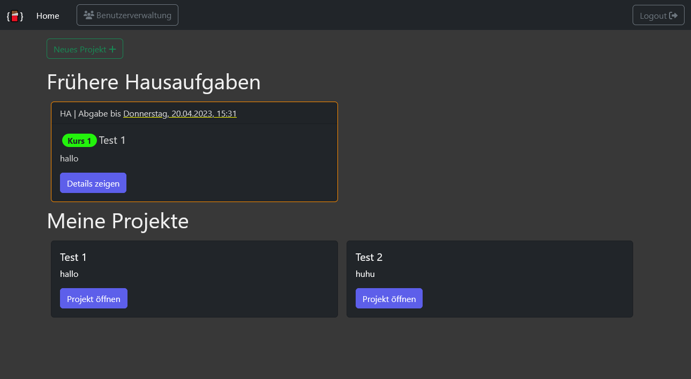
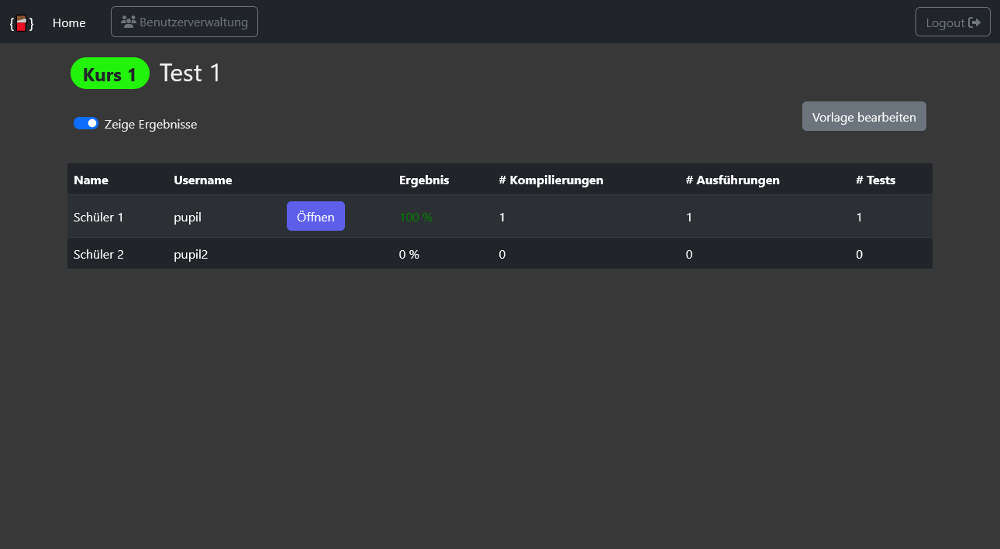
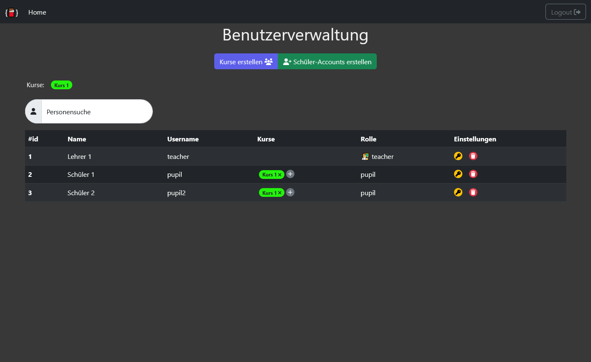

This gives a short overview of the project and it's components.

# Home
After login, pupils and teachers are redirected to the home page. Here they can see all their projects. In this case the user is a teacher, since he has access to the user management in der navbar. The first projects are homeworks (if any) and they are surrounded by different colors, depending on whether the submission deadline has already passed or not. Below are the private projects of the user.

# Homework
Homeworks are projects which are created by teachers and assigned to courses. They include a deadline. In this homework-view, the teacher can see the overview of the pupils' achievements. The results are based on how many tests of the JUnit tests were passed. You also see how often a pupil compiled, executed or tested its program. The teacher can open each pupils solution in the IDE with a single click. The private data (results and amounts of actions) are only visible after using the switch above the table.

# IDE
The IDE looks slightly different if it's opened by a pupil or a teacher. It also depends if it's private project or a homework. The three left of the colored buttons (save, compile and execute) are always available. Below the coding area,there is the output and at the very bottom is an input (eg. for the Java-Scanner).

# User Management
At the user management, teachers can create new courses (the colorful badge) and pupils (which can be created multiple at once). Users can be added to courses. The teacher can always reset/change the password of other users (since there is no mail-service).
